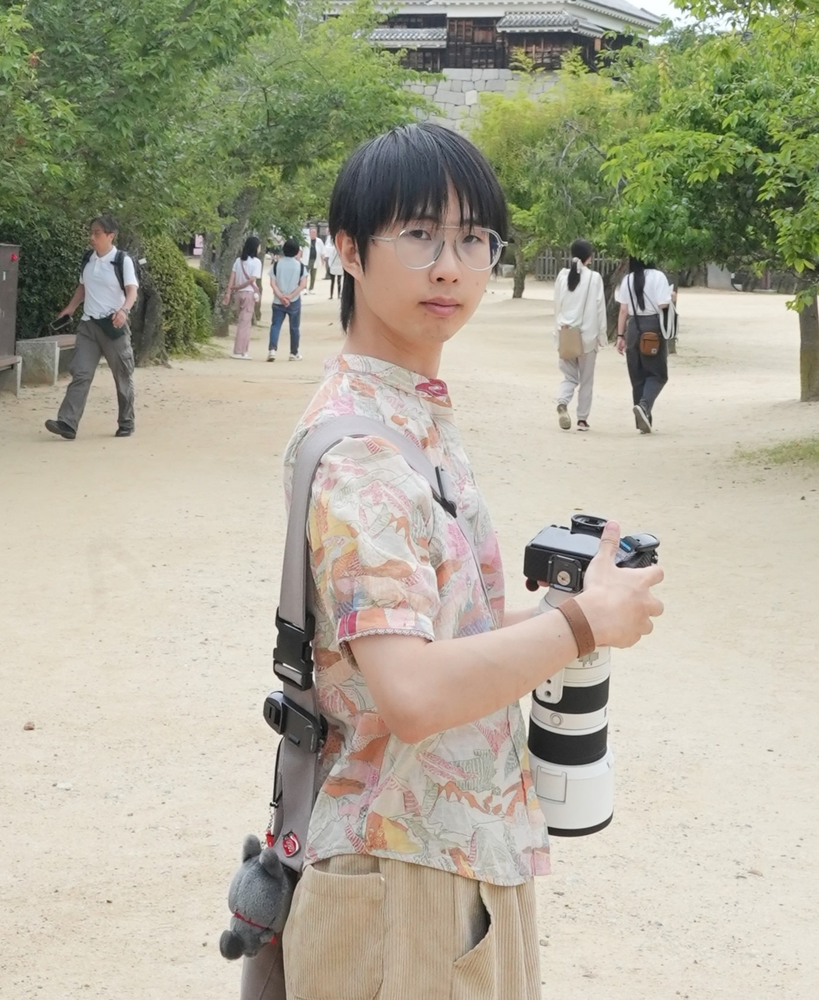

I am a Ph.D. student at Computer Science, [University of California at Santa Barbara](https://www.cs.ucsb.edu/), supervised by [Prof. Zheng Zhang](https://web.ece.ucsb.edu/~zhengzhang/).

Previously, I received my B.S. and M.S. from [EIC@Huazhong University of Science and Technology](http://english.eic.hust.edu.cn/), worked with [Prof. Jun Sun](https://hust.teacher.360eol.com/teacherBasic/preview?teacherType=&teacherId=15979), [Prof. Xinggang Wang](https://xwcv.github.io/) and [Prof. Yingzhuang Liu](https://hust.teacher.360eol.com/teacherBasic/preview?teacherType=&teacherId=15939). 

# Research Interests

My research interests focus on efficient pre-training for LLMs/VLMs, AI for science, computer vision, and the mathematical & physical principles behind them. I have recently focused on

 - Low-rank pre-training foundation models.
 - Low-precision training.
 - Sparse attention.

# News 

[09/2025] One of our recent works has been accepted by NeurIPS 2025. Congratulations to all collaborators!

[08/2025] One of our recent works has been accepted by EMNLP 2025 (oral). Congratulations to all collaborators!

# Publications

<!--J Journal C Conference  -->











